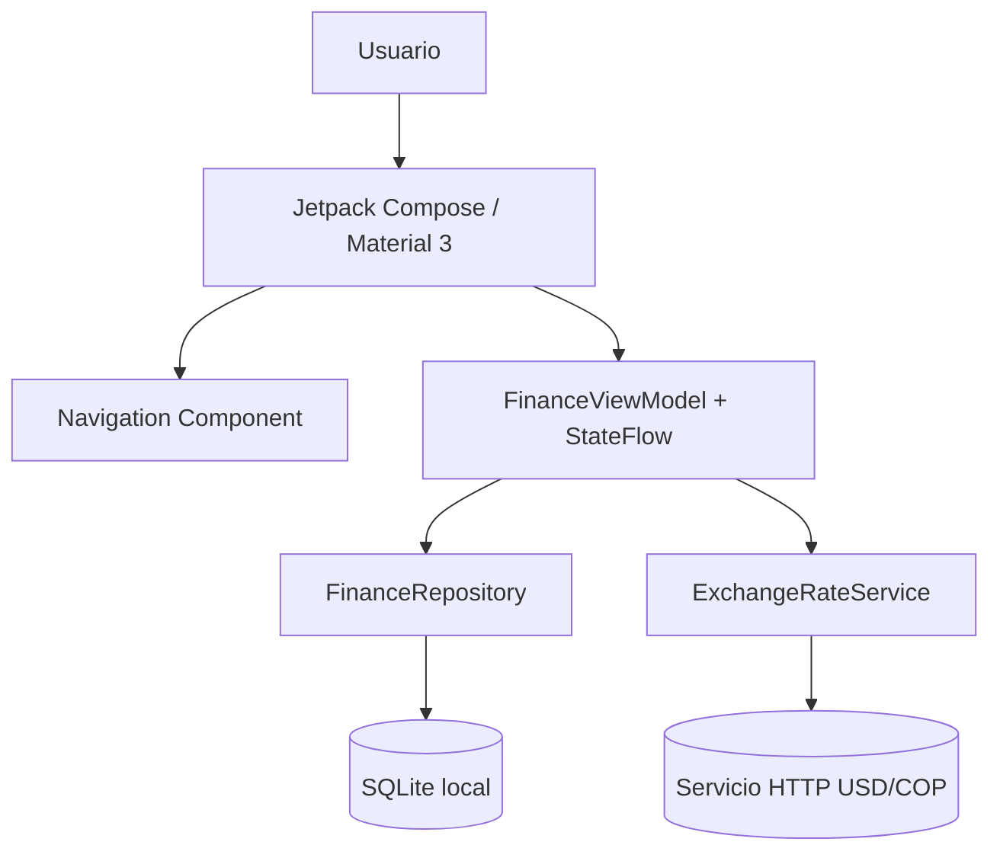

# Arquitectura del microproyecto

## Responsabilidad de cada módulo

- **UI / Compose:** renderiza las pantallas y transforma acciones del usuario en eventos.
- **Navigation:** mantiene las rutas entre Inicio, Movimientos, Añadir, Metas, Perfil y Acerca de.
- **ViewModel:** conserva el estado de UI y coordina las operaciones.
- **Repository:** centraliza el acceso a datos persistentes.
- **SQLite local:** almacena movimientos, metas, balances y preferencias.
- **Servicio HTTP:** demuestra la conexión a un servicio en línea mediante una consulta USD/COP.
